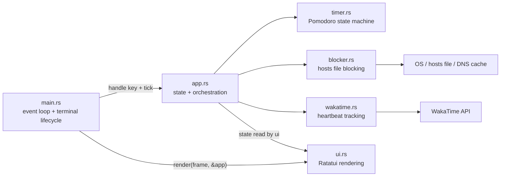
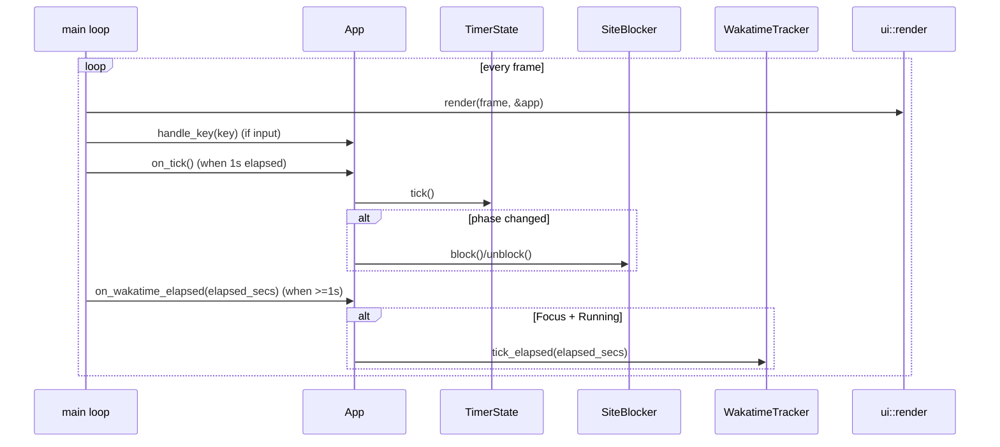

# Architecture

`focustime` is a single-binary Rust TUI application with six modules in `src/`:
timer logic, app state/orchestration, site blocking, WakaTime tracking, UI rendering,
and the main event loop.

## Visual overview

## Module map

| Module | Responsibility | Main collaborators |
| --- | --- | --- |
| `main.rs` | Entry point, terminal setup/teardown, event loop cadence, key event polling | `app`, `ui`, `crossterm`, `ratatui` |
| `app.rs` | Application state, mode switching, key handling, coordination between timer/blocker/WakaTime | `timer`, `blocker`, `wakatime` |
| `timer.rs` | Pomodoro domain model and transitions (`Focus`, `ShortBreak`, `LongBreak`) | `app` |
| `blocker.rs` | Hosts-file based site blocking/unblocking and DNS cache flush integration | `app`, OS commands/filesystem |
| `wakatime.rs` | WakaTime config parsing and heartbeat scheduling/sending | `app`, HTTP (`ureq`) |
| `ui.rs` | Ratatui rendering for Timer and Site Manager screens | `app`, `timer` |

## Related explanation

### Runtime flow (timer mode)

1. `main` creates `App`, initializes terminal state, and enters a loop.
2. Each loop iteration draws UI from current state (`ui::render(frame, &app)`).
3. Key events are routed to `App::handle_key`, which updates timer state, mode,
   site list, and quit intent.
4. A 100ms tick cadence accumulates elapsed time; every elapsed second triggers
   `App::on_tick()`, which advances timer state and reapplies block/unblock policy
   when phase transitions occur.
5. WakaTime tracking is synchronized by `App`: focus-running state starts/stops
   tracking, and elapsed focus seconds are fed to `WakatimeTracker::tick_elapsed`
   once per UI frame to avoid heartbeat bursts after suspend/resume.
6. Blocking policy is phase-aware: blocking is active only during focus sessions
   (running or paused), and removed for break/idle phases.

## Visibility rules

- Keep modules private to the binary crate via `mod ...` declarations in `main.rs`.
- Expose only cross-module API with `pub` (examples: `App`, `TimerState`,
  `SiteBlocker`, `WakatimeTracker`, `ui::render`).
- Keep implementation details private (`fn`) unless tests or same-crate use requires
  broader access.
- Use `pub(crate)` for crate-internal helpers that should not be externally visible
  (example: `SiteBlocker::strip_block_section`).
- Prefer private struct fields by default; make fields public only when direct
  read/write across modules is part of the intended state model.

## File conventions

- One top-level module per file in `src/` (`app.rs`, `timer.rs`, `blocker.rs`,
  `ui.rs`, `wakatime.rs`), with `main.rs` as the composition root.
- Keep domain logic (`timer`, `blocker`, `wakatime`) separate from presentation
  (`ui`) and orchestration (`app`).
- Place module tests in the same file using `#[cfg(test)] mod tests`.
- Keep platform-specific behavior explicit with `#[cfg(...)]` blocks in the module
  that owns that behavior.
- Use descriptive naming that reflects behavior (`on_tick`, `next_phase`,
  `apply_blocking_for_phase`, `send_heartbeat_async`) rather than generic helpers.
