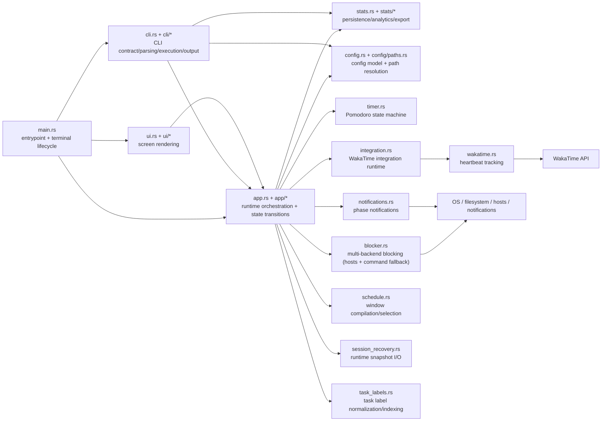
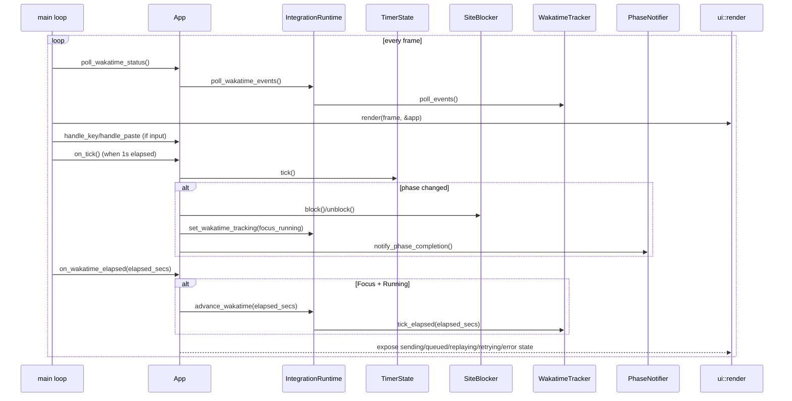

# Architecture

`focustime` is a single-binary Rust TUI application organized around stable
top-level facades (`app.rs`, `cli.rs`, `stats.rs`, `ui.rs`) plus focused
domain submodules. This structure keeps runtime behavior and public entry points
stable while splitting implementation details by responsibility.

## Visual overview

```mermaid
flowchart LR
    M["main.rs<br/>entrypoint + terminal lifecycle"]
    CLI["cli.rs + cli/*<br/>CLI contract/parsing/execution/output"]
    APP["app.rs + app/*<br/>runtime orchestration + state transitions"]
    UI["ui.rs + ui/*<br/>screen rendering"]
    ST["stats.rs + stats/*<br/>persistence/analytics/export"]
    CFG["config.rs + config/paths.rs<br/>config model + path resolution"]
    TM["timer.rs<br/>Pomodoro state machine"]
    BL["blocker.rs<br/>multi-backend blocking (hosts + command fallback)"]
    IG["integration.rs<br/>WakaTime integration runtime"]
    WK["wakatime.rs<br/>heartbeat tracking"]
    NT["notifications.rs<br/>phase notifications"]
    SCH["schedule.rs<br/>window compilation/selection"]
    REC["session_recovery.rs<br/>runtime snapshot I/O"]
    TL["task_labels.rs<br/>task label normalization/indexing"]
    OS["OS / filesystem / hosts / notifications"]
    API["WakaTime API"]

    M --> CLI
    M --> APP
    M --> UI
    APP --> CFG
    APP --> TM
    APP --> BL
    APP --> IG
    IG --> WK
    APP --> NT
    APP --> SCH
    APP --> ST
    APP --> TL
    APP --> REC
    CLI --> APP
    CLI --> CFG
    CLI --> ST
    UI --> APP
    BL --> OS
    NT --> OS
    WK --> API
```

## Module map

| Module                          | Responsibility                                                                                                                                                                                                                                                                                  | Main collaborators                                                                            |
| ------------------------------- | ----------------------------------------------------------------------------------------------------------------------------------------------------------------------------------------------------------------------------------------------------------------------------------------------- | --------------------------------------------------------------------------------------------- |
| `main.rs`                       | Composition root, CLI vs TUI dispatch, terminal setup/teardown, frame/tick loop                                                                                                                                                                                                                 | `cli`, `app`, `ui`, `crossterm`, `ratatui`                                                    |
| `app.rs` + `app/*`              | Core runtime state and orchestration split into focused domains (`timer_flow`, `task setup`, `site_manager`, `profile_management`, `schedule_*`, `persistence`, `history_goals`, `feedback_diagnostics`, `break_glass`, `cli_api`, `mode_keys`), with break-glass mapped into the temporary override recovery model | `timer`, `blocker`, `integration`, `notifications`, `schedule`, `stats`, `config` |
| `cli.rs` + `cli/*`              | CLI contract and execution pipeline split into `args`, `parsing`, `execute`, `status`, and `output`, including headless timer/session/workflow controls, break-glass override controls, and local backup/restore. The standalone calendar refresh, feature inventory export, task metadata/goal, session template, temporary allowlist, and daemon local API lifecycle commands are retired.                    | `app`, `config`, `stats`, `blocker`                                     |
| `stats.rs` + `stats/*`          | Stats data model plus split persistence/analytics/export/recording/planner/trends helpers, including canonical-path persistence, task-label grouping, and legacy read-time compatibility handling during deprecation windows                                                                                          | `app`, `task_labels`, filesystem                                                              |
| `ui.rs` + `ui/*`                | Screen-oriented Ratatui rendering split into `timer`, task setup, `site_manager`, `profile_manager`, `history`, and `setup`                                                                                                                                                                      | `app`, `timer`, `integration`                                                                 |
| `config.rs` + `config/paths.rs` | Config schema/normalization and environment-aware config path resolution, including feature-flag compatibility defaults, runtime knob settings, and global WakaTime metadata defaults                                                                                                          | `app`, `cli`, filesystem/env                                                                  |
| `timer.rs`                      | Pomodoro timer domain model and phase transitions                                                                                                                                                                                                                                               | `app`, `ui`                                                                                   |
| `blocker.rs`                    | Blocking backend orchestration (hosts + command), deterministic fallback selection, preview generation, and backend diagnostics                                                                                                                                                                 | `app`, `cli`, OS/filesystem                                                                   |
| `integration.rs`                | Narrow WakaTime integration runtime: config-driven activation plus supported calls for heartbeat polling, focus-running sync, elapsed focus tracking, heartbeat metadata updates, and runtime status access                                                                                    | `app`, `config`, `wakatime`                                                                   |
| `schedule.rs`                   | Recurring schedule window compile, overlap inspection, and occurrence selection logic                                                                                                                                                                                                            | `app`, `cli`, `config`                                                                        |
| `session_recovery.rs`           | Runtime recovery snapshot read/write, transient runtime artifact reconciliation, and startup warning notices for dropped invalid fragments                                                                                                                                                      | `app`, `cli`, filesystem                                                                      |
| `task_labels.rs`                | Task-label normalization, canonicalization, and index helpers                                                                                                                                                                                                                                   | `app`, `stats`, `cli`                                                                         |
| `wakatime.rs`                   | WakaTime config parsing and heartbeat scheduling/sending with retry, bounded offline queueing, and replay orchestration                                                                                                                                                                         | `app`, HTTP (`ureq`)                                                                          |
| `notifications.rs`              | Phase completion notifications and optional sound alerts                                                                                                                                                                                                                                        | `app`, OS notification commands                                                               |

## Runtime flow (timer mode)

```mermaid
sequenceDiagram
    participant Main as main loop
    participant App as App
    participant Integrations as IntegrationRuntime
    participant Timer as TimerState
    participant Blocker as SiteBlocker
    participant Waka as WakatimeTracker
    participant Notify as PhaseNotifier
    participant UI as ui::render

    loop every frame
        Main->>App: poll_wakatime_status()
        App->>Integrations: poll_wakatime_events()
        Integrations->>Waka: poll_events()
        Main->>UI: render(frame, &app)
        Main->>App: handle_key/handle_paste (if input)
        Main->>App: on_tick() (when 1s elapsed)
        App->>Timer: tick()
        alt phase changed
            App->>Blocker: block()/unblock()
            App->>Integrations: set_wakatime_tracking(focus_running)
            App->>Notify: notify_phase_completion()
        end
        Main->>App: on_wakatime_elapsed(elapsed_secs)
        alt Focus + Running
            App->>Integrations: advance_wakatime(elapsed_secs)
            Integrations->>Waka: tick_elapsed(elapsed_secs)
        end
        App-->>UI: expose sending/queued/replaying/retrying/error state
    end
```

1. `main` parses CLI arguments and either executes a CLI command path (`cli`) or
   boots the interactive TUI loop (`app` + `ui`).
2. Each TUI frame polls async WakaTime outcomes, renders via `ui::render`, then
   processes keyboard/paste input through `App` key handlers.
3. A 100ms cadence accumulates elapsed time; each elapsed second advances
   `App::on_tick()` and applies phase-driven side effects.
4. `App` keeps blocking, notifications, scheduling, and supported WakaTime tracking in sync with
   timer state; side effects are isolated in dedicated modules.
5. Headless automation routes through CLI timer/session/workflow commands; the
   daemon local API lifecycle and loopback `/v1/*` endpoints are retired.

## Visibility rules

- Keep top-level modules crate-private via `mod ...` declarations in `main.rs`.
- Use root facade modules (`app.rs`, `cli.rs`, `stats.rs`, `ui.rs`) as stable
  integration points; keep submodule details internal by default.
- Expose only cross-module API with `pub`/`pub(crate)` when required by
  collaborators or tests.
- Prefer private fields/functions unless cross-module mutation is intentional.

## File conventions

- Use a **facade + submodule** pattern for large domains:
  - `src/app.rs` with `src/app/*.rs`
  - `src/cli.rs` with `src/cli/*.rs`
  - `src/stats.rs` with `src/stats/*.rs`
  - `src/ui.rs` with `src/ui/*.rs`
  - `src/config.rs` with `src/config/paths.rs`
- Keep behavior grouped by domain responsibility (timer flow, task setup, schedule,
  CLI parsing, export logic, screen rendering) rather than by utility type.
- Place domain test suites in colocated `tests.rs` submodules where it improves
  readability and keeps facades focused.
- Keep platform-specific behavior explicit with `#[cfg(...)]` in the module that
  owns it.
- For release docs updates, keep architecture-facing terminology aligned with the
  module names and responsibility language used in `README.md`, `CHANGELOG.md`,
  and release tag examples in contributor-facing docs (for example, `v0.16.3`
  for this release cycle).
