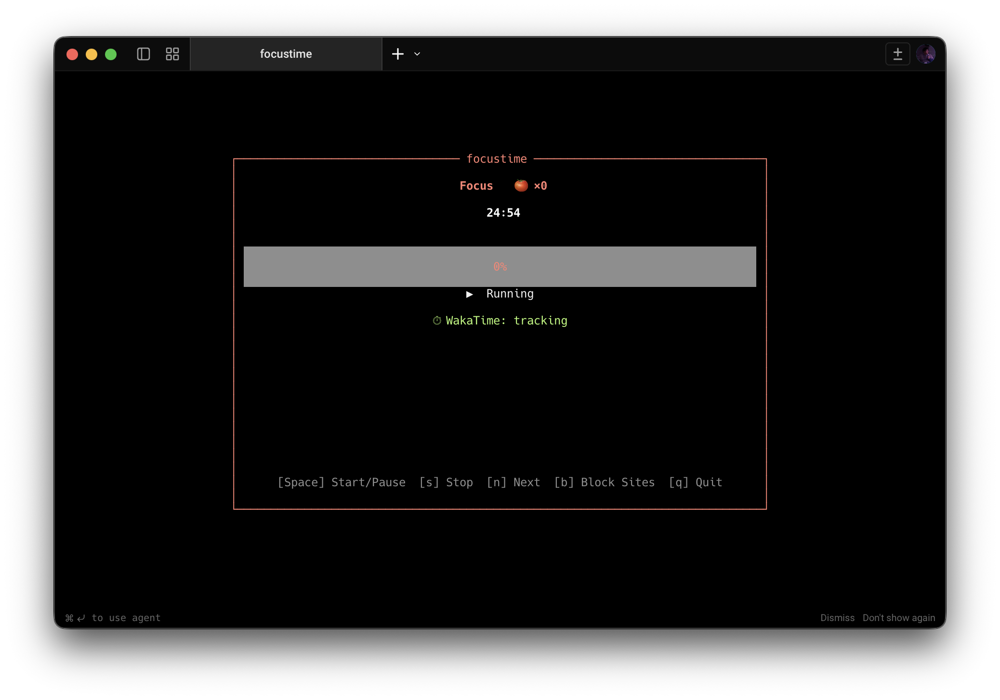
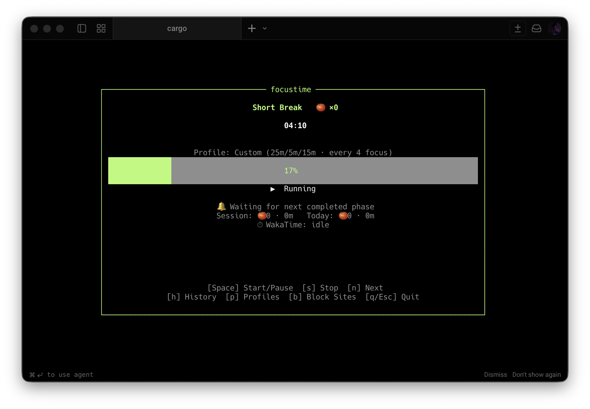
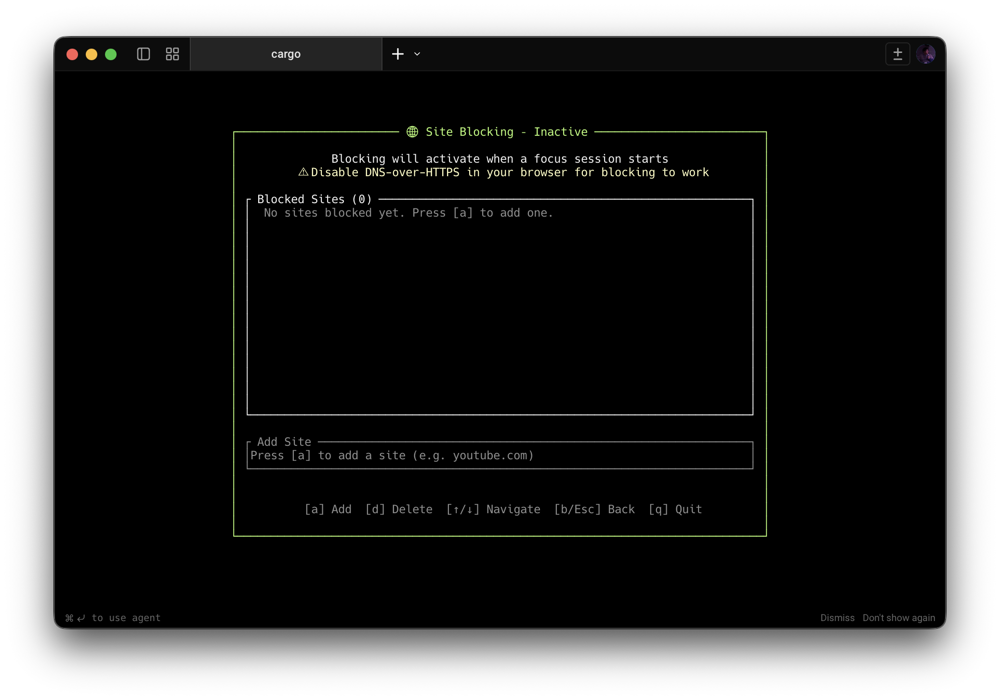
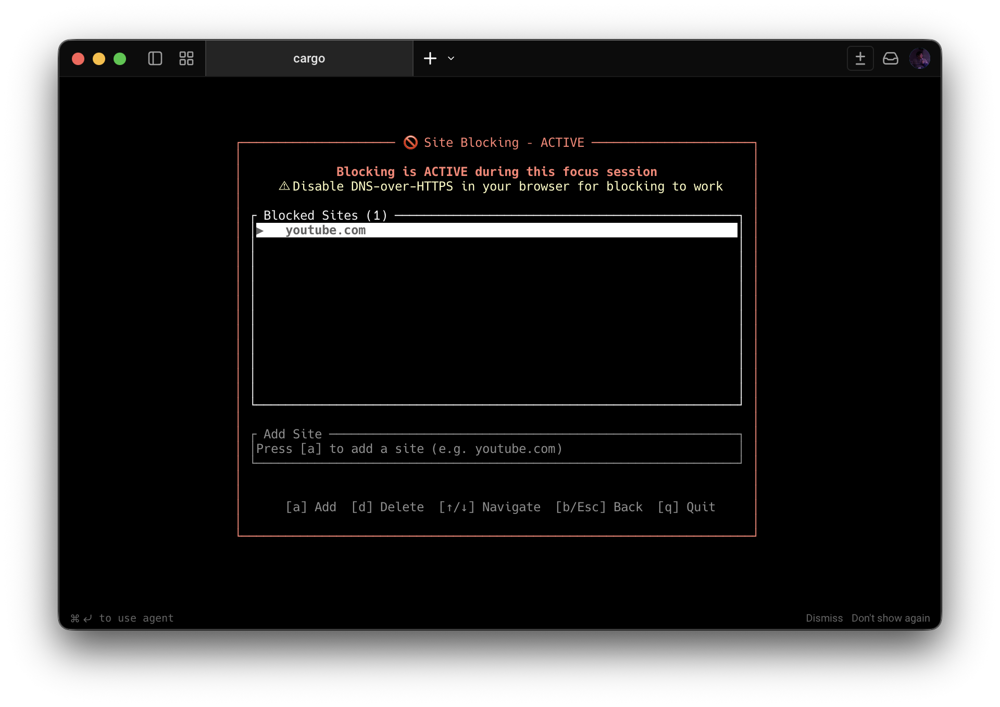
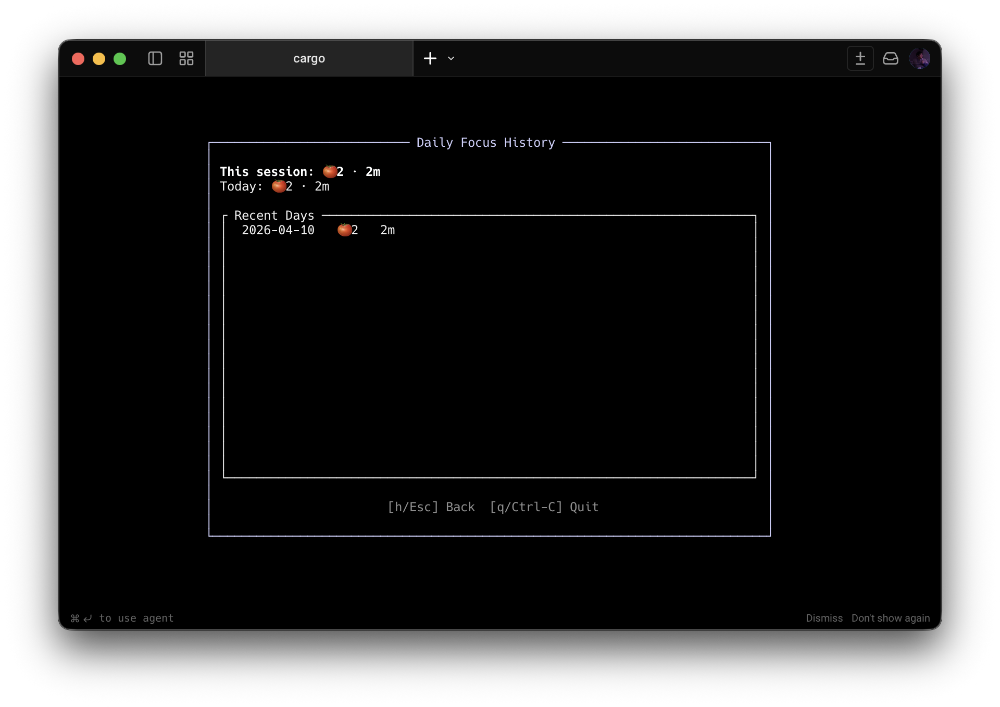
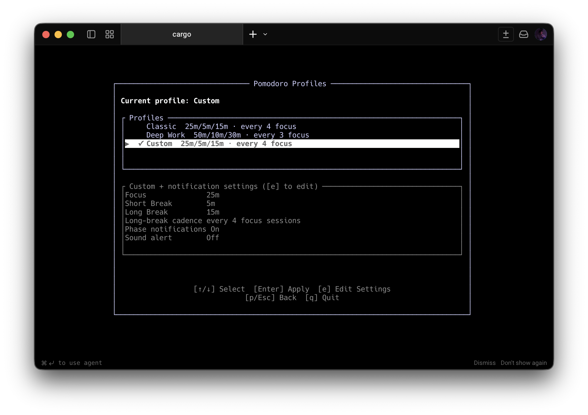

# focustime

[](https://github.com/utilForever/focustime/actions/workflows/rust.yml)
[](LICENSE)

TUI-based application for **Pomodoro timing**, **distraction-site blocking**, and **WakaTime tracking**.

<table>
  <tr>
    <td align="center">
      
      <p>Pomodoro - Focus</p>
    </td>
    <td align="center">
      
      <p>Pomodoro - Short Break</p>
    </td>
  </tr>
  <tr>
    <td align="center">
      
      <p>Site blocking - Inactive</p>
    </td>
    <td align="center">
      
      <p>Site blocking - Active</p>
    </td>
  </tr>
  <tr>
    <td align="center">
      
      <p>Daily Focus History</p>
    </td>
    <td align="center">
      
      <p>Pomodoro Profiles</p>
    </td>
  </tr>
</table>

## Quick Start

### Prerequisites

- Rust stable toolchain
- Git

### Build and run

```sh
git clone https://github.com/utilForever/focustime.git
cd focustime
cargo run
```

> Site blocking updates your OS hosts file and may require elevated privileges
> (`sudo`/Administrator). If permissions are insufficient, timer functionality
> still works, but blocking operations can fail.

### Development checks

```sh
cargo check --all
cargo fmt --all -- --check
cargo clippy --all-targets -- -D warnings
cargo test --all
```

## Pomodoro profiles

`focustime` now supports selectable Pomodoro profiles:

- **Classic** (25/5/15, long break every 4 focus sessions)
- **Deep Work** (50/10/30, long break every 3 focus sessions)
- **Custom** (editable in-app)

Open profile manager from timer view with **`p`**.

- `↑/↓`: move between profiles
- `Enter`: apply selected profile
- `e`: open profile/settings editor
- In editor: `↑/↓` selects field, `←/→` adjusts value, `Enter` saves

Profile selection and custom values are persisted in `config.toml`.

### Example config

```toml
selected_profile = "custom"

[custom_profile]
focus_secs = 1800
short_break_secs = 360
long_break_secs = 900
long_break_interval = 3

[notifications]
enabled = true
sound = false
```

## Phase notifications

`focustime` emits a phase notification when a phase naturally completes at `00:00`:

- **Focus complete** → next break starts
- **Break complete** → focus starts

Manual skip (`n`) changes phase immediately but does not emit a completion notification.

Notifications are delivered best-effort:

- terminal notice in the timer view
- desktop notification via platform-specific delivery (`winrt-toast-reborn` toast on Windows with a `msg` fallback, `osascript` on macOS, `notify-send` on Linux)
- optional sound alert using platform audio capabilities when `notifications.sound = true`

You can also configure `notifications.enabled` and `notifications.sound` directly from the TUI:

- open profile manager with `p`
- press `e` to open the editor
- use `↑/↓` to select **Phase notifications** or **Sound alert**
- use `←/→` to set `Off`/`On`, then `Enter` to save

## Session stats and daily history

`focustime` tracks:

- completed pomodoros for the current app session
- focused minutes for the current app session
- daily aggregates persisted in `stats.toml` (in the same config directory as `config.toml`)

From timer view:

- press **`h`** to open the daily history panel
- press **`h`** or **`Esc`** to return to timer view

## The way the system works

`focustime` is a single-binary Rust TUI app composed of seven modules in `src/`:

- `src/main.rs`: terminal lifecycle and event loop.
- `src/app.rs`: application state and orchestration.
- `src/timer.rs`: Pomodoro timer state machine.
- `src/blocker.rs`: hosts-file site blocking and unblocking.
- `src/wakatime.rs`: heartbeat tracking integration.
- `src/notifications.rs`: phase transition notifications and optional sound.
- `src/ui.rs`: Ratatui rendering for timer and site manager views.

WakaTime tracking is optional and activates only when an API key is configured
(read from `~/.wakatime.cfg`).

Runtime flow (high-level):

1. The main loop renders UI and reads keyboard input.
2. `App` handles key events (`start/pause`, `stop`, `next`, site manager actions).
3. Timer ticks advance every elapsed second while running.
4. Phase-completion notifications are dispatched asynchronously.
5. Blocking is applied during focus phases and removed outside focus.
6. WakaTime tracking stays in sync with focus-running state.

For full module map and design details, see [ARCHITECTURE.md](ARCHITECTURE.md).

## Contributing

Contributions are welcome. Please read [CONTRIBUTING.md](CONTRIBUTING.md) for:

- local quality checks
- coding and commit conventions
- pull request workflow

## Release automation

Pushing a tag that matches `v*` (for example, `v0.2.0`) triggers the release
workflow. It runs CI quality gates (`check`, `fmt`, `clippy`, `test`, dependency
`audit`, and `typos`), builds binaries for Linux/macOS/Windows, and publishes
them to the GitHub Release attached to that tag.

For a human-readable summary of notable changes, see [CHANGELOG.md](CHANGELOG.md).

## License


The class is licensed under the [MIT License](https://opensource.org/licenses/MIT):

Copyright &copy; 2026 [Chris Ohk](https://www.github.com/utilForever).

Permission is hereby granted, free of charge, to any person obtaining a copy of this software and associated documentation files (the "Software"), to deal in the Software without restriction, including without limitation the rights to use, copy, modify, merge, publish, distribute, sublicense, and/or sell copies of the Software, and to permit persons to whom the Software is furnished to do so, subject to the following conditions:

The above copyright notice and this permission notice shall be included in all copies or substantial portions of the Software.

THE SOFTWARE IS PROVIDED "AS IS", WITHOUT WARRANTY OF ANY KIND, EXPRESS OR IMPLIED, INCLUDING BUT NOT LIMITED TO THE WARRANTIES OF MERCHANTABILITY, FITNESS FOR A PARTICULAR PURPOSE AND NONINFRINGEMENT. IN NO EVENT SHALL THE AUTHORS OR COPYRIGHT HOLDERS BE LIABLE FOR ANY CLAIM, DAMAGES OR OTHER LIABILITY, WHETHER IN AN ACTION OF CONTRACT, TORT OR OTHERWISE, ARISING FROM, OUT OF OR IN CONNECTION WITH THE SOFTWARE OR THE USE OR OTHER DEALINGS IN THE SOFTWARE.
