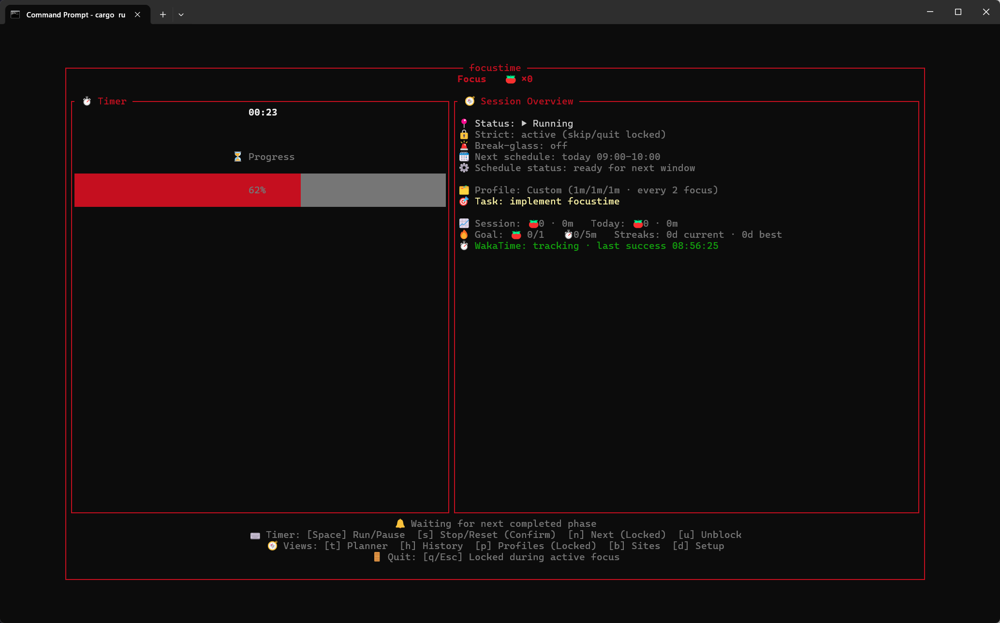
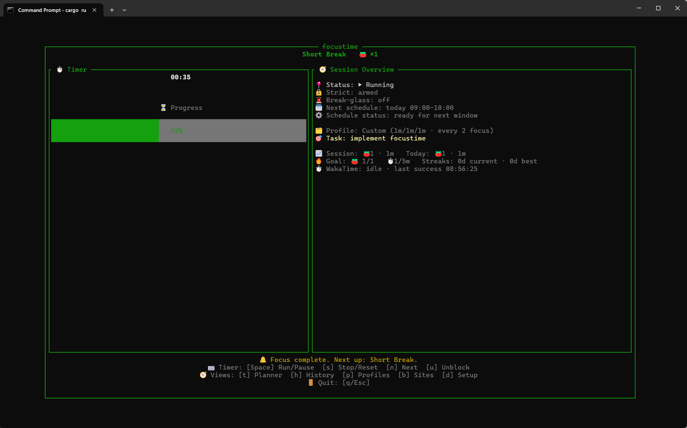
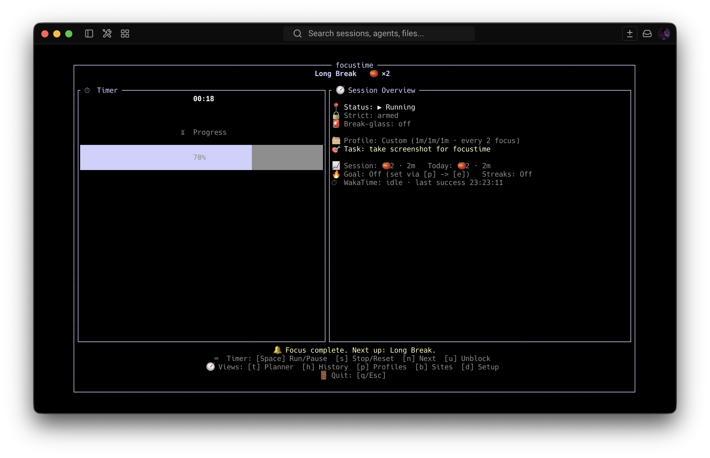
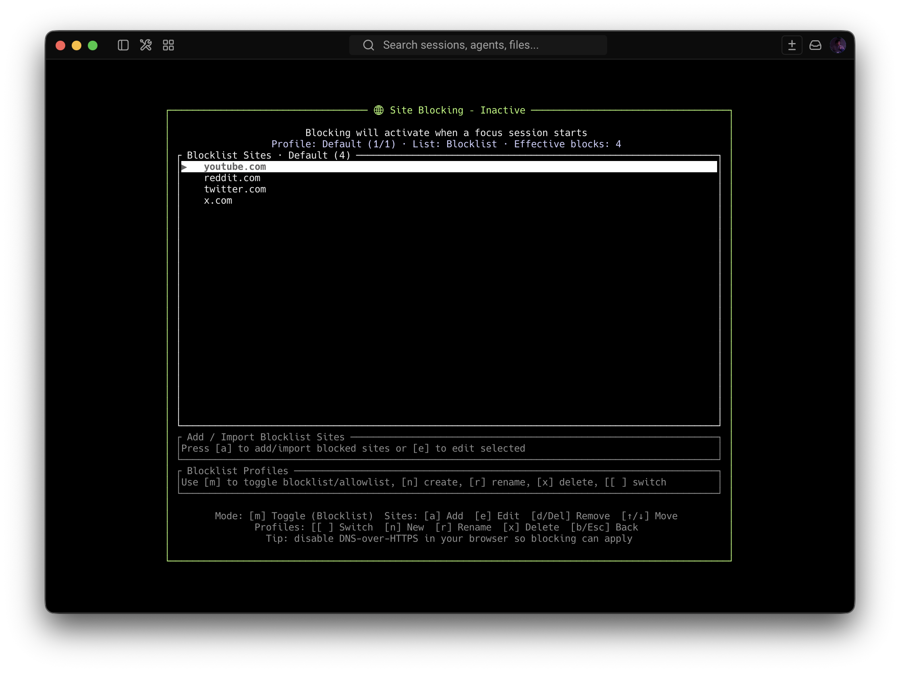
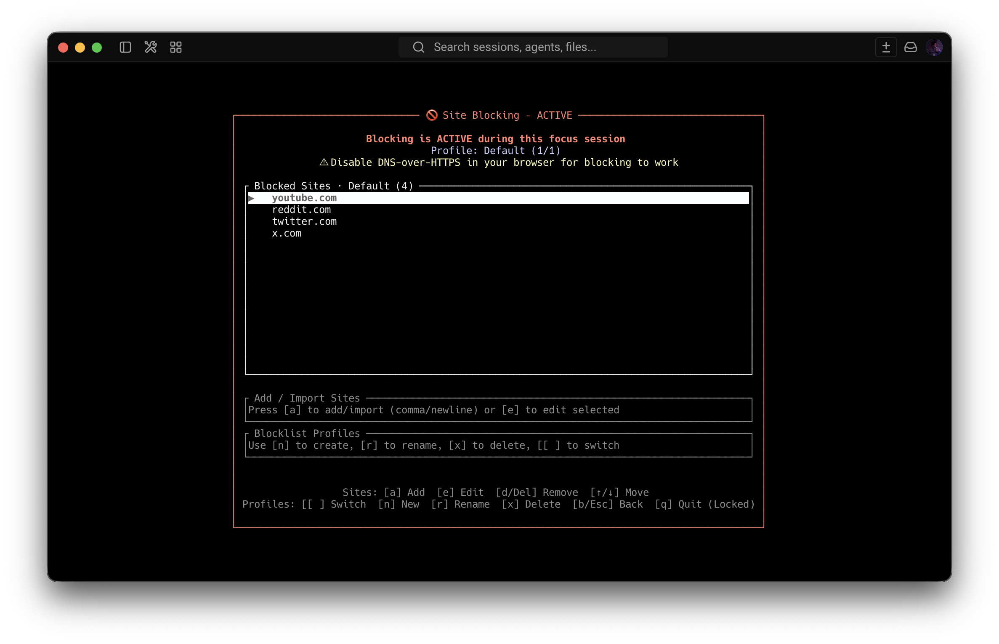
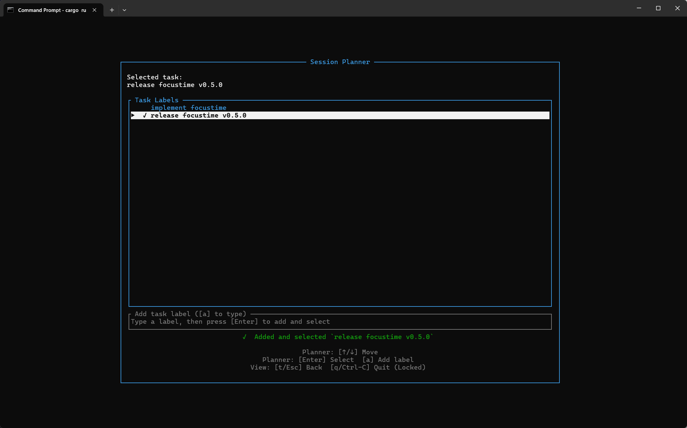
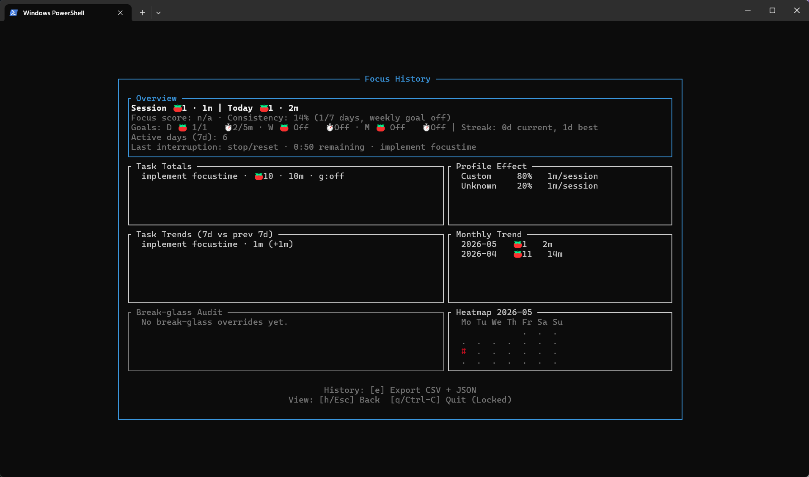
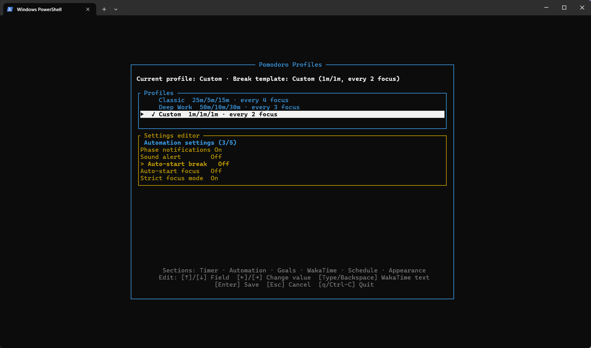
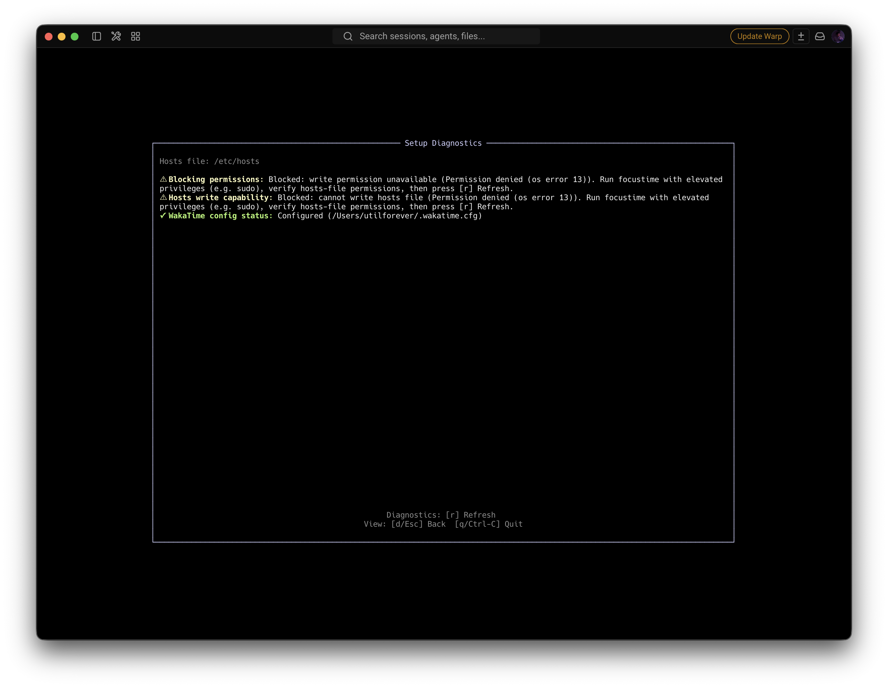

# focustime

[](https://github.com/utilForever/focustime/actions/workflows/rust.yml)
[](LICENSE)
[](https://github.com/utilForever/focustime/releases)
[](https://sonarcloud.io/summary/new_code?id=utilForever_focustime)
[](https://sonarcloud.io/summary/new_code?id=utilForever_focustime)

[](https://sonarcloud.io/summary/new_code?id=utilForever_focustime)
[](https://sonarcloud.io/summary/new_code?id=utilForever_focustime)
[](https://sonarcloud.io/summary/new_code?id=utilForever_focustime)
[](https://sonarcloud.io/summary/new_code?id=utilForever_focustime)
[](https://sonarcloud.io/summary/new_code?id=utilForever_focustime)

TUI-based application for **Pomodoro timing**, **distraction-site blocking**, and **WakaTime tracking**.

<table>
  <tr>
    <td align="center">
      
      <p>Pomodoro - Focus</p>
    </td>
    <td align="center">
      
      <p>Pomodoro - Short Break</p>
    </td>
    <td align="center">
      
      <p>Pomodoro - Long Break</p>
    </td>
  </tr>
  <tr>
    <td align="center">
      
      <p>Site Blocking - Inactive</p>
    </td>
    <td align="center">
      
      <p>Site Blocking - Active</p>
    </td>
    <td align="center">
      
      <p>Session Planner</p>
    </td>
  </tr>
  <tr>
    <td align="center">
      
      <p>Focus History</p>
    </td>
    <td align="center">
      
      <p>Pomodoro Profiles</p>
    </td>
    <td align="center">
      
      <p>Setup Diagnostics</p>
    </td>
  </tr>
</table>

## Quick Start

### Prerequisites

- Rust stable toolchain
- Git

### Build and run

```sh
git clone https://github.com/utilForever/focustime.git
cd focustime
cargo run
```

## CLI automation commands

`focustime` supports non-interactive CLI commands for scripting and automation.

Before running `--start`, select a task label first (with `--task` or in the TUI).

```sh
# Start focus timer without entering TUI
cargo run -- --start
cargo run -- --start --json

# Control timer flow without entering TUI
cargo run -- --pause
cargo run -- --resume
cargo run -- --stop
cargo run -- --next --json

# Run a headless daemon with local API access
cargo run -- --daemon-start
cargo run -- --daemon-start --daemon-port=43123 --json
cargo run -- --daemon-status --json
cargo run -- --daemon-stop --json

# Select task label (creates label if it does not exist yet)
cargo run -- --task "Write docs"
cargo run -- --task=Write-docs --json
# Archived labels are rejected by --task and cannot be used to start focus.

# Show or set cumulative goal targets for a task label
cargo run -- --task-goal "Write docs"
cargo run -- --task-goal "Write docs:120,4"
cargo run -- --task-goal=Write-docs:120,4 --json

# Show session metadata, or set it while focus is running/paused
cargo run -- --focus-intention
cargo run -- --focus-intention "Review PR feedback"
cargo run -- --task-note
cargo run -- --task-note="Capture blockers for retro" --json

# Show or set the active profile
cargo run -- --profile
cargo run -- --profile standard
cargo run -- --profile --json

# Show or set the active theme preset
cargo run -- --theme
cargo run -- --theme high-contrast
cargo run -- --theme deuteranopia-friendly --json

# Show or set daily goal targets (minutes,pomodoros)
cargo run -- --goal
cargo run -- --goal=120,4
cargo run -- --goal --json

# Show or set weekly goal targets (minutes,pomodoros)
cargo run -- --goal-weekly
cargo run -- --goal-weekly=600,20
cargo run -- --goal-weekly --json

# Show or set monthly goal targets (minutes,pomodoros)
cargo run -- --goal-monthly
cargo run -- --goal-monthly=2400,80
cargo run -- --goal-monthly --json

# Show or set goal carry-over behavior (on/off)
cargo run -- --goal-carry
cargo run -- --goal-carry=on
cargo run -- --goal-carry-weekly=on
cargo run -- --goal-carry-monthly=off
cargo run -- --goal-carry --json

# Show or set strict mode for the selected profile
cargo run -- --strict
cargo run -- --strict=on
cargo run -- --strict --json

# Manage blocklist profiles (active profile + CRUD)
cargo run -- --blocklist-profile
cargo run -- --blocklist-profile Work
cargo run -- --blocklist-profile-create Study
cargo run -- --blocklist-profile-rename "Deep Work"
cargo run -- --blocklist-profile-delete --json

# Manage categories within the active blocklist profile
cargo run -- --blocklist-category
cargo run -- --blocklist-category Social
cargo run -- --blocklist-category-create "Work Chat"
cargo run -- --blocklist-category-rename "Deep Focus"
cargo run -- --blocklist-category-delete --json

# Manage session templates (task/profile/blocklist/schedule bundles)
cargo run -- --session-template
cargo run -- --session-template "Deep Flow"
cargo run -- --session-template-create "Deep Flow"
cargo run -- --session-template-rename "Sprint Focus"
cargo run -- --session-template-apply
cargo run -- --session-template-apply "Deep Flow"
cargo run -- --session-template-delete --json

# Manage Focus History KPI dashboard cards
cargo run -- --history-dashboard
cargo run -- --history-dashboard-pin focus_score
cargo run -- --history-dashboard-unpin goal_streak
cargo run -- --history-dashboard-order=focus_score,goal_streak,session_summary,focus_risk,weekly_allocation,last_interruption,stats_growth,retention,comparison_filters
cargo run -- --history-dashboard --json

# Manage blocklist/allowlist sites for the active blocklist profile
cargo run -- --blocklist-sites
cargo run -- --allowlist-sites --json
cargo run -- --blocklist-category Social
cargo run -- --blocklist-site-add="youtube.com, *.facebook.com"
cargo run -- --allowlist-site-add "reddit.com"
cargo run -- --allowlist-site-add-temporary "reddit.com=30m,news.ycombinator.com=10m"
cargo run -- --blocklist-site-edit "youtube.com=news.ycombinator.com"
cargo run -- --allowlist-site-delete reddit.com

# Show/set schedule for the selected profile (including overlap/conflict inspection)
cargo run -- --schedule
cargo run -- --schedule-set='{"windows":[{"days":["mon","tue"],"start":"09:00","end":"11:00"}],"exception_dates":["2026-12-25"],"one_time_windows":[{"date":"2026-05-02","start":"14:00","end":"16:00"}]}'
cargo run -- --weekday-rules
cargo run -- --weekday-rules-set='[{"day":"mon","profile":"standard","blocklist_profile":"Work","session_template":"Deep Flow"}]'
cargo run -- --schedule-delay
cargo run -- --schedule --json
cargo run -- --weekday-rules --json

# Refresh calendar busy-window cache from configured ICS feeds
cargo run -- --calendar-sync
cargo run -- --calendar-sync --json

# Break-glass workflow controls from CLI (first call arms, second confirms)
cargo run -- --break-glass-trigger
cargo run -- --break-glass-trigger --json
# Cancel a pending break-glass confirmation
cargo run -- --break-glass-cancel

# Show the consolidated diagnostics workflow:
# setup checks, blocking preview details, config health, and config migration guidance
cargo run -- --diagnostics
cargo run -- --diagnostics --json

# Run only the config-health section (invalid/conflicting/stale config remediation)
cargo run -- --config-doctor
cargo run -- --config-doctor --json

# Preview/apply only config migration assistant changes for deprecated/renamed keys
cargo run -- --config-migrate
cargo run -- --config-migrate --json
# Apply mode writes migrated config.toml and creates a backup first
cargo run -- --config-migrate-apply
cargo run -- --config-migrate-apply --json

# Deprecated standalone preview path; use --diagnostics for the canonical workflow
cargo run -- --blocking-preview
cargo run -- --blocking-preview --json

# Deprecated standalone usage-signal path; use --feature-inventory for cleanup reporting
cargo run -- --usage-signals
cargo run -- --usage-signals --json

# Show status (text or JSON, including growth/retention signals, live timer/session fields, active temporary allowlist entries, latest interruption summary, and `selected_task_goal` in JSON)
cargo run -- --status
cargo run -- --status --json
cargo run -- --status --compare-by=profile --compare-limit=5
cargo run -- --status --compare-by=time-of-day --compare-task=Docs --compare-time=morning --json

# Watch status continuously (default 1s cadence, optional seconds override; Ctrl-C exits cleanly)
cargo run -- --status --watch
cargo run -- --status --watch=2 --json

# Back up config.toml and stats.toml to current directory or a target directory
cargo run -- --backup
cargo run -- --backup=./reports --json

# Restore config.toml and stats.toml from current directory or a source directory
# (restore requires both files to be present in the source directory)
cargo run -- --restore
cargo run -- --restore=./reports --json

# Export stats to current directory or a target directory
cargo run -- --export
cargo run -- --export=./reports --json

# Export feature inventory scoring report to current directory or a target directory
cargo run -- --feature-inventory
cargo run -- --feature-inventory=./reports --json
```

### Local daemon API

- Daemon mode binds to loopback (`127.0.0.1`) and stores daemon connection metadata in `daemon-state.toml` under the same app-data directory used by `config.toml`.
- Control endpoints require `Authorization: Bearer <token>`, where `<token>` is the per-start random token persisted in daemon metadata.
- API routes are versioned under `/v1/*`, including health (`/v1/health`), timer status (`/v1/status`), timer controls (`/v1/timer/*`), session metadata (`/v1/session/*`), workflow controls (`/v1/workflow/*`), and daemon shutdown (`/v1/daemon/stop`).

Backup/restore behavior:

- `--backup` creates the target directory if needed, then copies `config.toml` and `stats.toml` into it.
- `--restore` requires both files in the source directory and uses staged replacement so failed restores roll back to the original files.
- Runtime persistence is canonical-path only; if only legacy `stats.toml` exists, copy it to the canonical stats path (the backup/restore commands can help).

Retired workflow notice:

- `--sync-backup` and `--sync-restore` are retired; use local `--backup` and `--restore` for portable recovery workflows.
- `--sync-passphrase` is also retired; there is no direct replacement because encrypted sync/backups are no longer supported.

### Integration framework foundation

`focustime` now routes external-tool hooks through a typed integration runtime
with explicit lifecycle events and capability boundaries. The initial loading
model is config-driven activation of built-in integrations.

Current built-in integration IDs:

- `wakatime`

Config example (`config.toml`):

```toml
[feature_flags.integrations]
enabled = ["wakatime"]
```

Set `enabled = []` to disable all built-in integrations.

### Legacy compatibility deprecation milestones

`focustime --diagnostics` is the canonical diagnostics workflow for setup
checks, config health, and migration guidance. `focustime --config-doctor`,
`focustime --config-migrate`, and `focustime --config-migrate-apply` remain
available when you need to run only one config section. The TUI Setup
Diagnostics screen reports targeted setup deprecation warnings when legacy
compatibility fields are detected.

| Legacy field/path                                                                    | Canonical replacement                                                                                                                             | Removal milestone |
| ------------------------------------------------------------------------------------ | ------------------------------------------------------------------------------------------------------------------------------------------------- | ----------------- |
| Top-level `focus_secs`, `short_break_secs`, `long_break_secs`, `long_break_interval` | `[custom_profile]`                                                                                                                                | v0.12.0           |
| Top-level `notifications`, `auto_start`, `strict_mode`, `recurring_schedule`         | `[profile_automation.<preset>.notifications]`, `[profile_automation.<preset>.auto_start]`, and per-preset `strict_mode` / `recurring_schedule` | v0.12.0           |
| Top-level `blocked_sites` (without canonical profiles)                               | `[[blocklist_profiles]]` + `selected_blocklist_profile`                                                                                           | v0.12.0           |

Milestone policy:

- **v0.10.x migration window:** warning-only window with migration tooling (`--migrate`, `--backup`, `--restore`)
- **v0.11.0+:** retired temporary migration-only CLI compatibility flags (`--migrate`, `--dry-run`); `--backup`/`--restore` remain supported.
- **v0.15.2:** consolidated diagnostics are available through `--diagnostics`; config migration assistant + doctor commands remain available for focused config checks (`--config-migrate`, `--config-migrate-apply`, `--config-doctor`).
- **v0.12.0:** remove legacy field/path compatibility after the warning window

### v0.15.x cleanup roadmap

The v0.15.x line continues the cleanup work started in v0.14.x by reducing
overlapping command and config paths while keeping supported behavior available
through canonical surfaces. The guiding rule is that a path is only retired when
release notes and diagnostics name the replacement behavior.

Roadmap direction:

- Keep profile-oriented timer settings as the primary timer configuration path.
- Keep one focus-entry runtime path for scheduled, templated, and manual starts.
- Keep `--diagnostics` as the supported way to inspect setup health, config
  health, and migration guidance together; keep config migration and doctor
  commands for focused repair workflows.
- Keep local backup/restore workflows as the supported portable recovery path.
- Keep cleanup candidates tracked in the feature inventory before they are
  merged or retired.

Early deprecation notices:

| Deprecated or overlapping path | Supported replacement behavior |
| --- | --- |
| Legacy timer duration fields (`focus_secs`, `short_break_secs`, `long_break_secs`, `long_break_interval`) | Use `[custom_profile]`, profile presets, and `--profile`; run `--config-migrate` or `--config-migrate-apply` when stale keys are reported. |
| Legacy automation and blocklist top-level fields | Use per-profile automation tables, `[[blocklist_profiles]]`, and `selected_blocklist_profile`; inspect with `--config-doctor`. |
| Standalone blocking preview command (`--blocking-preview`) | Use `--diagnostics` for blocking preview details alongside setup/config health; older automation receives replacement guidance. |
| Standalone usage-signal command (`--usage-signals`) | Use `--feature-inventory` for cleanup reporting; raw command/screen frequency summaries remain internal cleanup inputs. |
| Removed migration-window flags (`--migrate`, `--dry-run`) | Use `--config-migrate` to preview config changes and `--config-migrate-apply` to write migrated config with a backup. |
| Retired encrypted sync flags (`--sync-backup`, `--sync-restore`, `--sync-passphrase`) | Use `--backup` and `--restore` for local portable recovery; there is no direct passphrase replacement because encrypted sync is retired. |
| Duplicate schedule/session start entry points | Select the task/profile/blocklist/schedule or apply a session template, then start focus through the unified timer flow with `--start` or the TUI. |

### Low-value feature retirements

Retired low-value command surfaces and replacements:

| Retired commands | Replacement behavior |
| --- | --- |
| `--migrate`, `--dry-run` | Use `--config-migrate` to preview config changes and `--config-migrate-apply` to write migrated config with a backup. |
| `--sync-backup`, `--sync-restore` | Use `--backup` and `--restore` for portable recovery and migration workflows. |
| `--sync-passphrase` | No direct replacement; encrypted sync/backups are no longer supported. |

### CLI JSON/error contract

- `--json` success responses are emitted to `stdout` as JSON and exit with code `0`.
- `--json` failures are emitted to `stdout` as JSON (no mixed human text) and exit with a non-zero code; removed command paths include replacement guidance in `error.hint`.
- `--status --watch --json` emits newline-delimited compact JSON snapshots continuously until interrupted, then exits cleanly after the current snapshot.
- Text-mode failures are emitted to `stderr` for interactive readability.

Exit codes:

- `0`: success
- `1`: runtime/command failure
- `2`: argument/usage failure

JSON failure shape:

```json
{
  "ok": false,
  "error": {
    "kind": "usage",
    "exit_code": 2,
    "message": "Unknown option `--unknown`.\n\nUsage:\n..."
  }
}
```

When no CLI command is provided, `focustime` keeps the default interactive TUI mode.

> Site blocking updates your OS hosts file and may require elevated privileges
> (`sudo`/Administrator). If permissions are insufficient, timer functionality
> still works, but blocking operations can fail.

### Development checks

```sh
cargo check --all
cargo fmt --all -- --check
cargo clippy --all-targets -- -D warnings
cargo test --all
```

### SonarCloud setup

Static analysis runs in `.github/workflows/sonarcloud.yml` for pushes and pull
requests to `main`.

1. Import `utilForever/focustime` into SonarCloud.
2. Confirm `sonar.projectKey` and `sonar.organization` in
   `sonar-project.properties` match your SonarCloud project.
3. Add `SONAR_TOKEN` as a repository secret in GitHub.

> For pull requests from forks, the SonarCloud job is skipped because
> repository secrets are not available in untrusted fork contexts.

## TUI layout and interaction model

The TUI keeps the same keyboard shortcuts, but uses a cleaner hierarchy and more
consistent screen structure:

- **Timer view** prioritizes phase/countdown/progress first, then shows grouped
  session context (task, profile, schedule, stats, WakaTime, strict/break-glass).
- **Manager/detail views** (sites, profiles, planner, history, diagnostics)
  follow a consistent pattern: context header, primary content block, feedback
  line, and compact command legend.
- **Profiles, planner, and history** are now laid out to fit narrower and
  shorter terminal windows than before.
- **Focus History** uses a redesigned structure with an overview block and
  dedicated task/trend/audit panels for faster scanning.
- **Command legends** use short grouped lines so common actions are easier to
  scan quickly during focus sessions.

## Keyboard shortcut customization

Core command shortcuts are configurable in `config.toml` under `[shortcuts]`.
Shortcut customization now also covers navigation/edit interactions used across
manager/editor flows.

For safety:

- `Ctrl-C` as a quit fallback
- text-entry `Type` and paste behavior stay native

Example:

```toml
[shortcuts]
open_stats_history = "y"
open_session_planner = "g"
back_stats_history = "y"
timer_stop_reset = "x"
quit = "q"
timer_toggle_pause = "space"
navigate_up = "up"
navigate_down = "down"
navigate_left = "left"
navigate_right = "right"
confirm = "enter"
cancel = "esc"
delete = "delete"
backspace = "backspace"
```

Navigation/edit tokens accept either a single character or a named key:
`enter`, `esc`, `up`, `down`, `left`, `right`, `delete`, `backspace`, `space`.

## Pomodoro presets

`focustime` now supports selectable Pomodoro presets:

- **Basic** (25/5/15, long break every 4 focus sessions)
- **Standard** (50/10/30, long break every 3 focus sessions)
- **Advanced** (editable in-app)

Open profile manager from timer view with **`p`**.

- `↑/↓` (default `navigate_up`/`navigate_down`): move between presets
- `Enter` (default `confirm`): apply selected preset
- `e`: open profile/settings editor
- In editor: `↑/↓` selects field, `←/→` adjusts numeric/boolean values (including **Theme preset**), `Type/Backspace` edits WakaTime project/language, `Enter` saves (all defaults are configurable via navigation/edit shortcut fields)

Preset selection, theme preset selection, custom durations, and preset-scoped
automation settings are persisted in `config.toml`.

## Session planner

Open the session planner from timer view with **`t`**.

- `←/→` (default `navigate_left`/`navigate_right`): switch between **Task Labels** and **Session Templates** panes
- `a`: in task pane, add a new task label; in template pane, capture a new template from current task/profile/blocklist/schedule
- `e`: in task pane, rename highlighted task label; in template pane, rename highlighted session template
- `d` or `Delete`: delete highlighted task label/template in the active pane
- `Enter` (default `confirm`): in task pane, select highlighted task label (archived labels are visible but cannot be selected); in template pane, apply highlighted template
- Task pane only: `f` toggle favorite (favorites are listed first), `x` toggle archive, `r` or `1-5` quick-pick recent labels
- `↑/↓` (default `navigate_up`/`navigate_down`): move selection in the active pane
- `t` or `Esc` (default `cancel`): return to timer view
- while adding/renaming a label or template, `Enter` (default `confirm`) saves and `Esc` (default `cancel`) cancels

Starting a focus session from idle now requires a selected task label. The timer
view always shows the current task label (or a reminder to select one).

## Focus history dashboard

Open Focus History from timer view with **`h`**.

- `k` / `j`: select previous/next KPI card
- `p`: pin/unpin selected KPI card
- `<` / `>`: move selected pinned card left/right
- `←/→`: cycle comparison dimension
- `↑/↓`: cycle task slice, `[`/`]`: cycle profile slice, `,`/`.`: cycle time-of-day slice

Pinned cards always render first in the dashboard list. Dashboard card order and
pin state persist to `config.toml` and can be scripted with
`--history-dashboard*` CLI commands.

### Mid-session notes

While a focus session is running or paused, press **`m`** in timer view to edit a
quick session note.

- type or paste note text
- `Enter`: save (replaces the previous note); if the draft is blank or only whitespace, the note is not saved and the task label is used instead
- `Esc`: cancel without changing the current note

Saved notes are reflected in live status metadata (`task_note`), recovery state,
and interruption/completed-session history export fields.

CLI parity is available via `--focus-intention`, `--task-note`, `--schedule-delay`, `--calendar-sync`,
`--weekday-rules*`, `--session-template*`, `--history-dashboard*`,
`--feature-inventory`, `--break-glass-trigger`, and `--break-glass-cancel` for non-interactive
inspection and in-session workflow control.

Blocklist rules support exact hosts and wildcard subdomain rules. `*.example.com`
matches `docs.example.com` and `api.example.com`, but does **not** match
`example.com`.

### Example config

```toml
schema_version = 2
selected_profile = "advanced"
selected_session_template = "Deep Flow"
selected_theme_preset = "classic"
selected_blocklist_profile = "Work"

[blocking_backend]
# hosts_only | hosts_then_command | command_then_hosts | command_only
policy = "hosts_then_command"

[blocking_backend.command]
block_command = ""
unblock_command = ""
diagnostics_command = ""

break_glass_duration_secs = 300

[shortcuts]
timer_toggle_pause = "space"
timer_stop_reset = "s"
open_session_planner = "t"
open_stats_history = "h"
history_dashboard_select_previous = "k"
history_dashboard_select_next = "j"
history_dashboard_toggle_pin = "p"
history_dashboard_move_left = "<"
history_dashboard_move_right = ">"
quit = "q"

[history_dashboard]
card_order = ["session_summary", "focus_score", "goal_streak", "focus_risk", "weekly_allocation", "last_interruption", "stats_growth", "retention", "comparison_filters"]
pinned_cards = ["session_summary", "focus_score"]

[[blocklist_profiles]]
name = "Work"
selected_category = "Social"

[[blocklist_profiles.categories]]
name = "Social"
sites = ["youtube.com", "*.facebook.com", "reddit.com"]
allowlist_sites = ["reddit.com"]

[[blocklist_profiles.categories]]
name = "News"
sites = ["news.ycombinator.com"]
allowlist_sites = []

[[blocklist_profiles]]
name = "Study"
selected_category = "General"

[[blocklist_profiles.categories]]
name = "General"
sites = ["x.com", "news.ycombinator.com"]
allowlist_sites = []

[[session_templates]]
name = "Deep Flow"
task_label = "Docs"
profile = "standard"
blocklist_profile = "Work"

[[session_templates.schedule.windows]]
days = ["mon", "tue", "wed", "thu", "fri"]
start = "09:00"
end = "11:00"

[custom_profile]
focus_secs = 1800
short_break_secs = 360
long_break_secs = 900
long_break_interval = 3

[profile_automation.advanced]
# Strict mode for the selected profile.
strict_mode = false

[profile_automation.advanced.notifications]
enabled = true
sound = false

[profile_automation.advanced.auto_start]
focus_to_break = false
break_to_focus = false

[profile_automation.advanced.recurring_schedule]
exception_dates = ["2026-12-25", "2027-01-01"]
[[profile_automation.advanced.recurring_schedule.windows]]
days = ["mon", "tue", "wed", "thu", "fri"]
start = "09:00"
end = "11:00"
[[profile_automation.advanced.recurring_schedule.one_time_windows]]
date = "2026-05-02"
start = "14:00"
end = "16:00"

[schedule_runtime]
time_step_minutes = 15
delay_secs = 600

[calendar_sync]
enabled = true
refresh_secs = 1800
lookahead_days = 14

[[calendar_sync.sources]]
name = "Google Work"
provider = "google" # ics | google | outlook (all use ICS feed URLs)
url = "https://calendar.google.com/calendar/ical/example/private-abc123/basic.ics"
enabled = true

[[calendar_sync.sources]]
name = "Outlook Team"
provider = "outlook"
url = "https://outlook.office365.com/owa/calendar/example@contoso.com/private-xyz456/calendar.ics"
enabled = true

[daily_goal]
minutes = 120
pomodoros = 4

[weekly_goal]
minutes = 600
pomodoros = 20

[monthly_goal]
minutes = 2400
pomodoros = 80

[stats_retention]
preset = "balanced" # keep_all | balanced | aggressive

[wakatime]
project = "focustime"
language = "Pomodoro"

[wakatime_runtime]
retry_backoff_secs = [2, 5, 10]
queue_capacity = 512
queue_retry_delay_secs = 30

[[wakatime.task_mappings]]
task_label = "Docs"
project = "Documentation"
language = "Markdown"

[[wakatime.task_mappings]]
task_label = "Review"
language = "Code Review"
```

`schema_version` is managed by focustime when writing `config.toml`. Files
without this key are treated as legacy and migrated automatically. If a file
declares a newer schema version than the running binary supports, focustime
attempts a best-effort load of known fields.

`[wakatime]` is optional. If omitted (or set to blank values), `focustime` uses
the defaults above for heartbeat metadata labels.

`[[wakatime.task_mappings]]` is also optional. When present, focustime matches
the active task label case-insensitively and overrides WakaTime metadata per
field:

- `project`: task-mapped value if provided, otherwise `[wakatime].project`
- `language`: task-mapped value if provided, otherwise `[wakatime].language`

Mappings with blank `task_label` or blank override values are ignored. If
duplicate task labels are configured, the first valid mapping is used.

`[schedule_runtime]` is optional. When omitted, focustime keeps existing
schedule runtime defaults (`time_step_minutes = 15`, `delay_secs = 600`).
`time_step_minutes` is clamped to `1..60`; `delay_secs` is clamped to
`60..43200`.

`[calendar_sync]` is optional. When omitted, calendar sync defaults to disabled
with `refresh_secs = 1800`, `lookahead_days = 14`, and no sources. Runtime
normalization clamps `refresh_secs` to `300..86400` and `lookahead_days` to
`1..90`, trims source names/URLs, auto-fills blank source names
(`calendar-source-N`), and removes duplicate provider+URL sources.

`[wakatime_runtime]` is optional. When omitted, focustime keeps existing
WakaTime runtime defaults (`retry_backoff_secs = [2, 5, 10]`,
`queue_capacity = 512`, `queue_retry_delay_secs = 30`). Backoff entries are
bounded to `1..300` seconds (up to 8 entries, empty/invalid falls back to
defaults), queue capacity is clamped to `1..4096`, and queue replay delay is
clamped to `1..3600`.

## Site manager workflow

Open the site manager from timer view with **`b`**.

- `a`: add/import hostnames
- `e`: edit the selected hostname
- `d` or `Delete`: remove the selected hostname
- `m`: toggle between editing blocklist sites and allowlist exceptions
- `[` / `]`: switch active blocklist profile
- `←` / `→`: switch active category in the current profile
- `n`: create a blocklist profile
- `r`: rename the active blocklist profile
- `x`: delete the active blocklist profile
- `Ctrl+n`: create a blocklist category
- `Ctrl+r`: rename the active blocklist category
- `Ctrl+x`: delete the active blocklist category
- `↑/↓` (default `navigate_up`/`navigate_down`): move selection
- `b`: return to timer view
- `Esc` (default `cancel`): return to timer view only when add/edit mode is not active

Add/import input supports:

- single hostnames (`youtube.com`)
- wildcard subdomain rules (`*.example.com`; subdomains only)
- comma-separated lists (`youtube.com, reddit.com`)
- newline-separated lists (paste multi-line blocklists, then press `Enter`)
- while add/import or edit mode is active, `Enter` (default `confirm`) commits and `Esc` (default `cancel`) cancels the current draft

Invalid and duplicate entries are reported inline so you can fix them without leaving the view.

Allowlist entries act as explicit exceptions: effective focus blocking is computed as
**blocklist sites minus allowlist sites** for the active profile, using exact and
wildcard rule matching.

For hosts-based blocking to apply reliably, keep DNS-over-HTTPS disabled in your browser.
If you configure the command backend, ensure your custom commands enforce equivalent restrictions.

## Setup diagnostics

Open the setup diagnostics screen from timer view with **`d`**.

- `r`: refresh diagnostics checks
- `d` or `Esc`: return to timer view

The diagnostics screen reports:

- backend policy/order and last backend selection (including fallback usage)
- command backend readiness
- blocking permissions
- hosts file write capability
- blocking preview summary and backend target details
- remediation guidance when hosts or command backend readiness is insufficient
- WakaTime config status (`~/.wakatime.cfg` and `api_key` availability)
- WakaTime runtime queue/retry status (`not configured`, `idle`,
  `tracking`, `sending`, `queued`, `replaying`, `retrying`, `error`, and
  related pending counts/backoff details)

The CLI diagnostics command adds blocking preview details, config health
findings, and migration preview guidance to the same workflow:

```sh
focustime --diagnostics
focustime --diagnostics --json
```

The standalone `focustime --blocking-preview` path remains as deprecated
replacement-guided output for older automation; new scripts should read the
`blocking_preview` section from `focustime --diagnostics --json`.

The standalone `focustime --usage-signals` path remains as deprecated
replacement-guided output for older automation; cleanup scripts should use
`focustime --feature-inventory --json` and treat raw usage-signal summaries as
internal cleanup inputs.

Blocking backend policy is deterministic:

- `hosts_then_command` (default): try hosts first, then command backend fallback
- `command_then_hosts`: try command first, then hosts fallback
- `hosts_only` / `command_only`: disable fallback

Command backend templates support `{sites_csv}`, `{sites_lines}`, and `{site_count}` placeholders.

## Phase notifications

`focustime` emits a phase notification when a phase naturally completes at `00:00`:

- **Focus complete** → next break phase
- **Break complete** → focus phase

Manual skip (`n`) changes phase immediately but does not emit a completion notification.

Notifications are delivered best-effort:

- terminal notice in the timer view
- desktop notification via platform-specific delivery (`winrt-toast-reborn` toast on Windows with a `msg` fallback, `osascript` on macOS, `notify-send` on Linux)
- optional sound alert using platform audio capabilities when `profile_automation.<preset>.notifications.sound = true`

Natural, non-catchup phase transitions can also auto-start the next timer with safe defaults (`Off`):

- `profile_automation.<preset>.auto_start.focus_to_break` starts break timers automatically after focus completion on non-catchup ticks
- `profile_automation.<preset>.auto_start.break_to_focus` starts focus timers automatically after break completion on non-catchup ticks

Recurring schedule windows can also trigger focus behavior at wall-clock times:

- `profile_automation.<preset>.recurring_schedule.windows[].days` accepts day tokens (`mon`..`sun`, case-insensitive)
- `profile_automation.<preset>.recurring_schedule.windows[].start` / `end` use 24-hour `HH:MM` local time (`start < end`)
- `profile_automation.<preset>.recurring_schedule.exception_dates` accepts `YYYY-MM-DD` local dates and skips automatic schedule triggering on those days
- `profile_automation.<preset>.recurring_schedule.one_time_windows[]` accepts one-time date windows with `date` (`YYYY-MM-DD`) plus `start`/`end` (`HH:MM`)
- when a window begins, focus auto-starts if possible; otherwise schedule mode arms and shows a reminder until you manually start focus
- while a schedule window is active and focus is not already running, press `z` to delay the scheduled start (configurable via `[schedule_runtime].delay_secs`, default `10m`, clamped `60..43200` seconds)
- recurring exception dates only skip recurring windows; one-time windows still apply on their configured date
- if multiple windows overlap, the most recently started active window takes precedence; windows with the same start time are resolved deterministically
- `--schedule` (text and JSON) reports detected schedule conflicts/overlaps without rejecting the schedule
- `weekday_profile_rules[]` can bind weekday (`day`) to a profile (`profile`), blocklist profile (`blocklist_profile`), and optional session template (`session_template`)
- weekday profile rules apply at startup and day boundaries; they do not continuously re-assert during the same day
- the timer session overview shows the current/next scheduled window
- when calendar sync cache is available, schedule text adds `calendar busy` for active calendar events and a `calendar overlap` warning for upcoming schedule collisions
- `--calendar-sync` refreshes the cache from configured ICS feeds (including Google/Outlook ICS feed URLs)

You can configure notification and auto-start settings directly from the TUI:

- open profile manager with `p`
- press `e` to open the editor
- automation and schedule edits apply to the currently selected profile only
- the editor is grouped into sections (**Timer**, **Automation**, **Goals**, **Appearance**, **WakaTime**, **Schedule**) to keep settings easier to scan
- use `↑/↓` (default `navigate_up`/`navigate_down`) to select **Phase notifications**, **Sound alert**, **Auto-start break**, **Auto-start focus**, **Strict focus mode**, **Daily/Weekly/Monthly goal (minutes)**, **Daily/Weekly/Monthly goal (pomodoros)**, **Theme preset**, **WakaTime project/language**, or the **Schedule** fields
- use `←/→` (default `navigate_left`/`navigate_right`) to adjust values (or toggle `Off`/`On` for boolean fields), use `Type/Backspace` (default `backspace`) for WakaTime text fields, then `Enter` (default `confirm`) to save
- schedule editing is in-app:
  - **Schedule add/remove**: `→` adds a window, `←` removes selected window
  - **Schedule window**: `←/→` changes which window is selected
  - **Schedule day** + **Schedule day enabled**: choose day cursor and toggle it `Off/On`
  - **Schedule start/end**: adjust times in `[schedule_runtime].time_step_minutes` steps (default `15`, clamped `1..60`)
  - **Schedule exception**: `←/→` changes which exception date is selected
  - **Exception date**: `←/→` moves selected exception date backward/forward by 1 day
  - **Exception add/remove**: `→` adds a date (starting from today), `←` removes selected date
  - **One-time window**: `←/→` changes which one-time window is selected
  - **One-time date**: `←/→` moves selected one-time window date backward/forward by 1 day
  - **One-time start/end**: adjust one-time window times in `[schedule_runtime].time_step_minutes` steps (default `15`, clamped `1..60`)
  - **One-time add/remove**: `→` adds a one-time window (starting from today), `←` removes selected window
  - **Weekday rule**: `←/→` changes which weekday rule entry is selected
  - **Weekday day/profile/blocklist/template**: tune target weekday and linked profile/blocklist/session-template values
  - **Weekday add/remove**: `→` adds a rule for an unused day, `←` removes selected rule
  - **Conflict inspector**: read-only summary of detected schedule overlaps/conflicts

## Session recovery

`focustime` persists in-progress timer sessions so restart/crash recovery can resume where you left off.

- while a focus/break phase is running or paused, the app saves phase, remaining time, task metadata (`task_label`, `focus_intention`, `task_note`), and active profile
- startup recovery also reconciles transient workflow runtime artifacts when still valid (schedule delay + arming continuity, break-glass state, and strict-reset confirmation state)
- while editing with `m`, pressing `Enter` replaces the in-progress session `task_note` and immediately syncs recovery metadata; if the draft is blank or only whitespace, the note is not saved and the task label is used instead
- on startup, valid in-progress state is restored and shown in the timer notice line
- on startup, blocking is reconciled with recovered timer state: recovered active focus re-applies blocking, while non-recovered startup attempts to remove stale crash-era block entries
- stale or invalid saved recovery/runtime artifacts are ignored safely with a startup warning notice
- recovery state is cleared when an in-progress phase ends naturally or when you reset/skip out of the active session

## Strict focus mode

`focustime` provides an optional strict mode (`strict_mode = false` by default).

When strict mode is enabled during an active focus session:

- `n` (skip phase) is disabled
- `s` (stop/reset) requires confirmation by pressing `s` again
- `p` (profile manager) is disabled, so profile switching is locked
- quit shortcuts (`q`, `Esc`, `Ctrl-C`) are disabled until focus is no longer active

## Break-glass override for site blocking

During an active focus session, you can temporarily pause site blocking with an explicit two-step confirm:

- press `u` to arm break-glass
- press `u` again to confirm and temporarily unblock

The same workflow is available in CLI mode using `--break-glass-trigger` (arm/confirm) and
`--break-glass-cancel` (cancel pending confirmation).

While active, timer status shows a live countdown. When the countdown expires, blocking resumes automatically if focus is still active.

Override events are recorded for audit visibility in the History view and included in export metadata (`focustime-stats.json` and `focustime-stats.csv`).

## Session stats and history

`focustime` tracks:

- completed pomodoros for the current app session
- focused minutes for the current app session
- daily aggregates persisted in `stats.toml` in the canonical data/state directory
- weekly totals derived from daily aggregates in the History view
- weekly consistency score (`active_days / 7`, rounded to `%`) derived from daily activity
- weekly focus score KPI (50/50 blend of consistency and weekly goal completion; `n/a` when weekly goal is off)
- profile effectiveness comparison (focus share % and average focused minutes per completed session)
- productivity comparison rows by task/profile/time-of-day with optional slice filters
- per-task totals (pomodoros and focused minutes) derived from labeled focus sessions
- per-task trend summaries in History (`last 7 days` vs `previous 7 days`)
- per-task cumulative goals (minutes/pomodoros) with per-label progress and met/in-progress evaluation
- structured interruption events for manual `stop/reset` and `skip/next` actions
- current streak and best streak based on completed daily goals
- growth indicators (`record` count + estimated `stats.toml` size + top high-volume sections)

Current retention presets for historical records:

- `keep_all`: no automatic pruning
- `balanced` (default): keep daily aggregates, prune `focus_sessions` at 365 days, prune `session_interruptions` and `break_glass_overrides` at 180 days
- `aggressive`: prune daily aggregates at 365 days, `focus_sessions` at 180 days, and `session_interruptions` / `break_glass_overrides` at 90 days

Retention is enforced when stats are persisted. Existing data older than the selected windows is pruned on save.

If daily, weekly, or monthly goals are configured, timer and history views also
show live progress for each period:

- target focused minutes
- target completed pomodoros

Streaks are evaluated against the goal that was active on each day. Changing the
daily goal later does not rewrite older tracked days, and streak tracking stays
inactive when today's goal is off.

From timer view:

- press **`h`** to open the history panel with weekly and daily summaries
- while history is open, use **`←/→`** to switch comparison dimension; **`↑/↓`** task filter; **`[`/`]`** profile filter; **`,`/`.`** time-of-day filter
- while the history panel is open, press **`e`** to export `focustime-stats.json` and `focustime-stats.csv` into the current working directory
- press **`h`** or **`Esc`** to return to timer view

Exports include daily/weekly aggregates, weekly consistency, weekly focus score,
profile effectiveness, productivity comparisons, task summaries/trends,
interruption records, and labeled focus-session records where task labels were
attached. Focus-session rows
persist and export first-class `focus_intention` and `task_note` fields; when
dedicated metadata input is not provided, both fields default to the selected
`task_label`. Interruption records include structured `reason` values and
remaining-time metadata. Export files now also include a `history_kpis` JSON
object covering all History dashboard KPI cards (`session_summary`,
`focus_score`, `goal_streak`, `focus_risk`, `weekly_allocation`,
`last_interruption`, `stats_growth`, `retention`, `comparison_filters`), with
matching CSV `history_kpi` rows (`kpi_card_id` + `kpi_payload_json`) for
JSON/CSV parity. Export files expose `schema_version` (currently `7`) so
downstream consumers can handle versioned contracts explicitly.

## The way the system works

`focustime` is a single-binary Rust app organized around top-level facade modules
with focused submodules (updated in #240):

- `src/main.rs`: composition root, CLI/TUI dispatch, terminal lifecycle, and event loop.
- `src/app.rs` + `src/app/*.rs`: runtime state/orchestration split by domain (timer flow, planner, profiles, site manager, schedule, persistence, diagnostics, CLI API).
- `src/cli.rs` + `src/cli/*.rs`: CLI args/parsing/execution/status/output pipeline.
- `src/feature_inventory.rs`: deterministic feature inventory catalog, scoring model, and report export helpers.
- `src/stats.rs` + `src/stats/*.rs`: stats persistence, analytics, trends, recording, planner state, and exports.
- `src/ui.rs` + `src/ui/*.rs`: Ratatui rendering split by screen (timer, session planner, site manager, profile manager, history, setup diagnostics).
- `src/config.rs` + `src/config/paths.rs`: config schema/normalization and environment-aware path resolution.
- Supporting core modules: `src/timer.rs`, `src/blocker.rs`, `src/schedule.rs`, `src/calendar.rs`, `src/session_recovery.rs`, `src/task_labels.rs`, `src/integration.rs`, `src/wakatime.rs`, and `src/notifications.rs`.

WakaTime tracking is optional and activates only when an API key is configured
(read from `~/.wakatime.cfg`).

Runtime flow (high-level):

1. `main` parses CLI args and either runs a CLI command path or starts the TUI loop.
2. In TUI mode, each frame renders UI and reads keyboard/paste input.
3. `App` handles key events (`start/pause`, `stop`, `next`, session planner actions, site manager actions).
4. Timer ticks advance every elapsed second while running.
5. Phase-completion notifications are dispatched asynchronously.
6. Blocking is applied during focus phases and removed outside focus.
7. WakaTime tracking is managed via `IntegrationRuntime` (`App ->
   IntegrationRuntime -> WakaTime`) and applies async heartbeat outcomes without
   blocking timer flow.

### WakaTime reliability behavior

When WakaTime is configured, heartbeats are still best-effort and non-blocking.
The timer never waits on network calls.

- transient heartbeat failures (`429`, `5xx`, and connectivity/timeout errors)
  retry with bounded backoff (default `2s`, then `5s`, then `10s`, configurable via
  `[wakatime_runtime].retry_backoff_secs`)
- retryable failures that still cannot be delivered are queued in a durable local
  backlog (bounded, drop-oldest at capacity; default `512`, configurable via
  `[wakatime_runtime].queue_capacity`) and replayed oldest-first after restart
  and when connectivity recovers
- queued heartbeat replay delay after retryable failure starts at `30s`, doubles
  after each consecutive retryable replay failure (up to `3600s`), and is
  configurable via `[wakatime_runtime].queue_retry_delay_secs`
- invalid/corrupt persisted queue snapshots are dropped on startup and surfaced
  as a runtime warning in WakaTime status
- non-retryable failures are surfaced in the timer view status line
- status line reflects runtime states (`tracking`, `sending`, `queued`,
  `replaying`, `retrying`, `error`, `idle`, `not configured`) and, when
  configured, also shows the last successful heartbeat time (`HH:MM:SS`) or
  `not yet sent` before first success

For full module map and design details, see [ARCHITECTURE.md](ARCHITECTURE.md).

## Contributing

Contributions are welcome. Please read [CONTRIBUTING.md](CONTRIBUTING.md) for:

- local quality checks
- coding and commit conventions
- pull request workflow

## Release automation

Pushing a tag that matches `v*` (for example, `v0.15.2`) triggers the release
workflow. It runs CI quality gates (`check`, `fmt`, `clippy`, `test`, dependency
`audit`, and `typos`), builds binaries for Linux/macOS/Windows, and publishes
them to the GitHub Release attached to that tag.

The latest stable release is [v0.15.2](https://github.com/utilForever/focustime/releases/tag/v0.15.2).

For a human-readable summary of notable changes in this release, see [CHANGELOG.md](CHANGELOG.md).

## License


The class is licensed under the [MIT License](https://opensource.org/licenses/MIT):

Copyright &copy; 2026 [Chris Ohk](https://www.github.com/utilForever).

Permission is hereby granted, free of charge, to any person obtaining a copy of this software and associated documentation files (the "Software"), to deal in the Software without restriction, including without limitation the rights to use, copy, modify, merge, publish, distribute, sublicense, and/or sell copies of the Software, and to permit persons to whom the Software is furnished to do so, subject to the following conditions:

The above copyright notice and this permission notice shall be included in all copies or substantial portions of the Software.

THE SOFTWARE IS PROVIDED "AS IS", WITHOUT WARRANTY OF ANY KIND, EXPRESS OR IMPLIED, INCLUDING BUT NOT LIMITED TO THE WARRANTIES OF MERCHANTABILITY, FITNESS FOR A PARTICULAR PURPOSE AND NONINFRINGEMENT. IN NO EVENT SHALL THE AUTHORS OR COPYRIGHT HOLDERS BE LIABLE FOR ANY CLAIM, DAMAGES OR OTHER LIABILITY, WHETHER IN AN ACTION OF CONTRACT, TORT OR OTHERWISE, ARISING FROM, OUT OF OR IN CONNECTION WITH THE SOFTWARE OR THE USE OR OTHER DEALINGS IN THE SOFTWARE.
